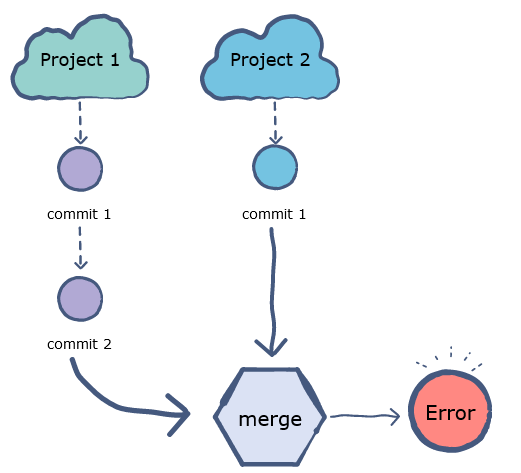

为了方便我<s>写博客</s>做知识管理，我的台式机（主力机）和Windows平板上都有一份laurenfrost.github.io的repo。但我更多的时间是坐在台式机前，所以大部分的更新都是从我台式机上的repo来push到GitHub的。至于我的平板，则只有偶尔出门的时候会用，因此平板上的repo的进度就落后很多。而且经常有只在平板上写了几个字就放在那里了，最后是在台式机上重新hexo new了一个post，然后deploy的。

今天我为了乘凉跑到咖啡店里，打算接着写之前的内容的的，就打算直接把GitHub里的更新给pull到平板里的repo。结果就遇到了下面的报错：  

```
ascdut@FrozenSatellite:~/laurenfrost.github.io$ git pull http://github.com/laurenfrost/laurenfrost.github.io.git
warning: redirecting to https://github.com/laurenfrost/laurenfrost.github.io.git/
remote: Enumerating objects: 539, done.
remote: Counting objects: 100% (539/539), done.
remote: Compressing objects: 100% (129/129), done.
remote: Total 462 (delta 183), reused 446 (delta 167), pack-reused 0
Receiving objects: 100% (462/462), 28.39 MiB | 3.51 MiB/s, done.
Resolving deltas: 100% (183/183), completed with 33 local objects.
From http://github.com/laurenfrost/laurenfrost.github.io
 * branch            HEAD       -> FETCH_HEAD
fatal: refusing to merge unrelated histories
```

unrelated？我他妈直接问号。怎么就让它unrelated了呢？果断Google。然后我在[这里](https://www.educative.io/edpresso/the-fatal-refusing-to-merge-unrelated-histories-git-error)找到了解决方案。

> `fatal: refusing to merge unrelated histories`这个报错指的是git正在尝试把两个不相关的project给merge到一起（或者说，有两个project，它们之间没有意识到另一方的存在，它们各自都有自己的commit)，这样一来git就无从判断究竟该舍弃哪些文件、更新哪些文件，只能报错。
>   
> 造成这种情况一般有两种可能：  
> + 你之前克隆了这个repo，但是`./.git`文件夹里面的信息现在损坏了。这就使得git无法确定你本地repo的历史和你的意图，当你push或者pull远程repo的时候就会报这个错。  
> + 还有一种情况，你在你的repo上添了几个commit，然后你pull远程repo。但这个时候远程repo已经有别的commit的了，现在git拿不准要不要删了你本地的commit，就只能报错了。  
> 解决办法很简单，在命令后面加一个`--allow-unrelated-historie`的参数即可，比如：  
> ```
> git pull origin master --allow-unrelated-histories
> ```

看到这个命令我突然意识到我犯了一个傻逼的错误：我没有指定要pull的branch。
```
git pull <origin> [branch]
```
如果不指定branch的话，命令默认pull的branch是master。而根据GitHub的规则，master必须放编译好的html页面及其资源，所以我把自己hexo博客的source以及theme里的相关配置文件全部放在了一个叫hexo的branch里。因此这个平板的repo里全是hexo branch里的文件。checkou一下果然如此：  
```
ascdut@FrozenSatellite:~/laurenfrost.github.io$ git checkout
M       package.json
Your branch is up to date with 'origin/hexo'.
```
那么在命令里加上hexo不就解决了吗？  
Naive！又报错了！  
```
git pull https://github.com/laurenfrost/laurenfrost.github.io.git hexo
remote: Enumerating objects: 130, done.
remote: Counting objects: 100% (130/130), done.
remote: Compressing objects: 100% (44/44), done.
remote: Total 82 (delta 43), reused 77 (delta 38), pack-reused 0
Unpacking objects: 100% (82/82), done.
From https://github.com/laurenfrost/laurenfrost.github.io
 * branch            hexo       -> FETCH_HEAD
Updating d68e6da..f1e023c
error: Your local changes to the following files would be overwritten by merge:
        package.json
Please commit your changes or stash them before you merge.
Aborting
```
本地repo跟远程repo相比还是有change，还提示我要么先commit，要么就stash它们。  
stash是啥？是没见过的浮莲子啊。  
> stash 英 [stæʃ]	美 [stæʃ]  
> v. 存放；贮藏；隐藏；
> n. 贮藏物;

根据[这个博客](https://blog.csdn.net/liyazhen2011/article/details/83501134)所说，stash可以把当前工作现场“保存”起来，等以后恢复现场后继续工作。

对于这种报错，其实除了stash之外还有别的思路存在：[为什么不问问神奇的stackoverflow呢](https://stackoverflow.com/questions/14318234/how-do-i-ignore-an-error-on-git-pull-about-my-local-changes-would-be-overwritt)  