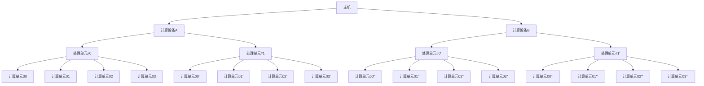

## OpenCL 平台模型
OpenCL 的平台模型由主机及其相连的一个或多个 OpenCL 设备组成。

通常主机是指包含 x86 或 ARM 处理器的一个计算平台；设备则更自由，可以是 CPU（也可以讲主机端的 CPU 作为 OpenCL 设备）、GPU、DSP、FPGA 或者硬件制造商提供的支持 OpenCL 的其他产品。

每个 OpenCL 设备有一个或者多个计算单元（Compute Units，CU），而每一个计算单元又由一个或多个处理单元（Processing Element，PE）组成。处理单元是设备上执行数据计算的最小单元。它们之间的关系由下图所示：

## OpenCL 执行模型
OpenCL 程序包含主机端程序和设备端内核（kernel）程序。主机端程序运行在主机处理器上，主机端程序以命令的形式将内核程序从主机提交到 OpenCL 设备，OpenCL 设备在处理单元上执行计算。根据这两个不同的执行单元定义了 OpenCL 执行模型。

内核在 OpenCL 设备上执行，完成 OpenCL 应用的具体工作。内核通常是一些计算量大、逻辑比较简单的函数，OpenCL 设备通过内核将输入数据计算处理后输出的到主机。

OpenCL 中定义了三类内核：

1. OpenCL 内核。
2. 原生内核。
3. 内建内核。

由于 OpenCL 设备通常没有 IO 处理能力，因此 IO 操作通常由主机承担，这意味着程序开始执行时，数据通常都在主机上，故 OpenCL 设备需要从主机上获得数据， 待 OpenCL 设备计算完成后，又需要将数据从 OpenCL 设备复制回主机。

### 上下文